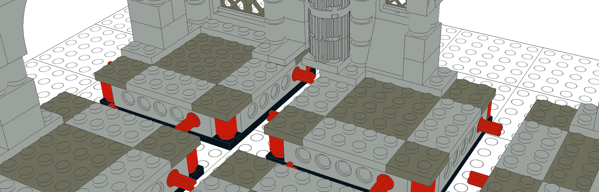

# Modular *LEGO*® Tabletop RPG Dungeons

The goal of this project is to establish a reasonable standard of modular gameplay sections, constructed entirely of [LEGO](https://www.lego.com/), for the playing of [tabletop role-playing games](https://en.wikipedia.org/wiki/Tabletop_role-playing_game).

Head over to the [specification document](Specification.md) to read about the details, or take a look at the various [examples](examples/).

## Acknowledgements

* Leonardo Zide's [LeoCAD](http://www.leocad.org/) for providing a concept testing & screenshot tool
* James Jessiman's [LDraw](http://www.ldraw.org/) for creating the foundation for open-source digital LEGO building
* [The LEGO Group](https://www.lego.com/) for providing a world of toys to entertain generations
* Peter F. Guenther's [BrickQuest](http://gunth.com/brickquest/) modular dungeons ([version 1](http://gunth.com/brickquest/modules.htm) and [version 2](http://gunth.com/brickquest/newmod2/modules.htm))
* Watching my brother play [Cathedral of the Deep (spoilers)](http://darksouls3.wiki.fextralife.com/Cathedral+of+the+Deep) in *Dark Souls Ⅲ*