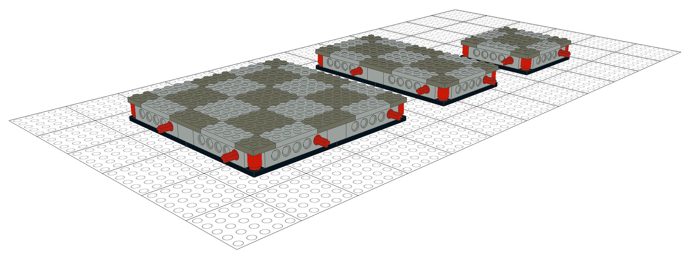

#Specification for Modular *LEGO*® Tabletop Role-Playing Game Dungeons

[ToC]

##Rationale

* LEGO is fun
    * easy to create custom, detailed environments with LEGO primitives
    * lots of minifigure pieces, easy to create characters
* LEGO world is inherently grid-based, ideal for grid-based games
* see: BrickQuest
    * same:
        * 4x4 stud tiles
        * 2-stud width walls
        * full tiles within walls, walls on base
    * issues:
        * based on baseplates ("improvement") = no stacking or variable elevation!
        * full pin connectors may make it difficult to detach sections
        * 12x12 stud sections can't be halved for very small sections (not a power of 2)
        * dedicated room connector pieces
* set up reasonable section interface standard so sections designed by various people can connect most of the time

##Terminology

|  |  |
|---|---|
| *stud* | the basic LEGO round connector, usually found arrayed on the top surface of *bricks* and *tiles*, and used as a basic unit of measurement |
| *brick* | the basic LEGO building piece, and used as a basic unit of measurement |
| *tile* | a class of LEGO piece that is 1/3 of a *brick* in height, and used as a alternate unit of measurement |
| *slope* | a class of LEGO piece that has an upwards or downwards sloping section |
| *pin* | a LEGO Technic piece consisting of one or more stud-length partially-split hollow tubes with a bead around the edge of the split end, typically used as a connector that only permits rotation around the tube's axis |
| *section* | the basic modular building block of a dungeon |
| *game tile* | a division of game-space on which a single character can reside |
| *wall* | a game-space division marker through while characters typically cannot pass |
| *Minifigure* | the standard poseable LEGO figurine, 4 *bricks* in height, about 4 studs in width, and about 2 studs in depth when not decorated with items; the standard "skin" color is yellow |

**Examples of bricks**

**Examples of tiles**

**Examples of slopes**

**Examples of pins and pinned parts**

**Example of an undecorated Minifigure**

##Dimensions

* based on 4x4 stud tiles = game tiles
* standard modular section is 16x16 studs, abut directly with no separator
* half sections of 16x8 studs
* quarter sections of 8x8 studs

##Base Construction

* few specific parts required as long as interface matches
* full-size is 16x16, so used for reference
* use 1/2 pins as connectors
    * 1/2 pins' short end is a stud, so allows either male or female side to substitute studs and stud holes if the section design requires
    * don't use full pins, as there is no bias for pin to stay connected to its parent base
    * 3/4 pins have bias, but require female side to be a pin hole or full-depth stud hole, restricting building options on female side
* 5 tiles in height (1 brick + 2 tiles)
    * why not 2 bricks?
        * designed so that this is the absolute base of gameplay, reduce parts
        * would get in the way of spacers for elevation changes
        * feel free to add 1 tile spacers — see *Elevation Changes*

* examples use `Technic Brick 1 x 6 with Holes (3894)` but only the holes at either end are used
    * left side is female
    * right side is male
* corners are constructed with 1 x 1 round bricks to assist in separation — e.g. insert a screwdriver or other prying tool
* interior construction is unspecified

##Game Tile Layout

* squares shifted 50%
    * 2 stud border so spaces align with walls
    * with alternating grid, light/dark squares match up regardless of rotation
    * there is a "center" game tile of every section or collection of sections

##Walls

* walls are not a modular section separate from base
* outer 2 studs of base considered "potential wall section"
* allows space for actual wall as well as relief decorations
* walls back-to-back ends up with 4-stud depth — one game tile

###Overlapping Walls

* "splitting" unsplittable parts
    * e.g. pillars made with `Brick 2 x 2 Round (3941)` or decorations using `Brick 2 x 2 x 3 with Lion's Head Carving and Cutout (30274)`
    * for compatibility with other sets, try to avoid
    * compatibility matters less with sub-sections designed to build bigger rooms
    * helps make seamless walls in that case

##Ceilings

* try not to get in the way of placing Minifigures and other objects
* avoid overhangs
* overhangs should extend over game tiles no more than 2 studs past walls
* archways and other doorways are an exception

##Elevation Changes

* stairs, ramps, hillocks, etc.
* should have section connectors all around base; optional but encouraged on side of elevation change
* additional section connectors at floor/ground level on side of elevation change
* shim connecting sections with bricks and tiles as-needed to reach elevation difference

##Stacking

* attach upper sections by 2-12 studs
* probably not a great idea in most cases, use a separate setup for each floor

##Non-Standard Game Tile Arrangements

* outdoor areas
* ornate entrances
* if game tiles don't align, "where" a character is standing is at the dungeon master's discretion

##Area Revelation

* secret doors
* different floors
* other visibility restrictions
* designed to be connected & disconnected quickly