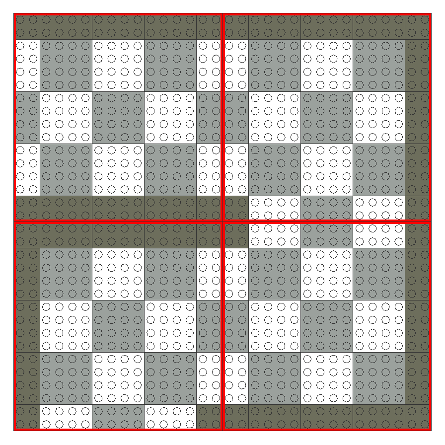
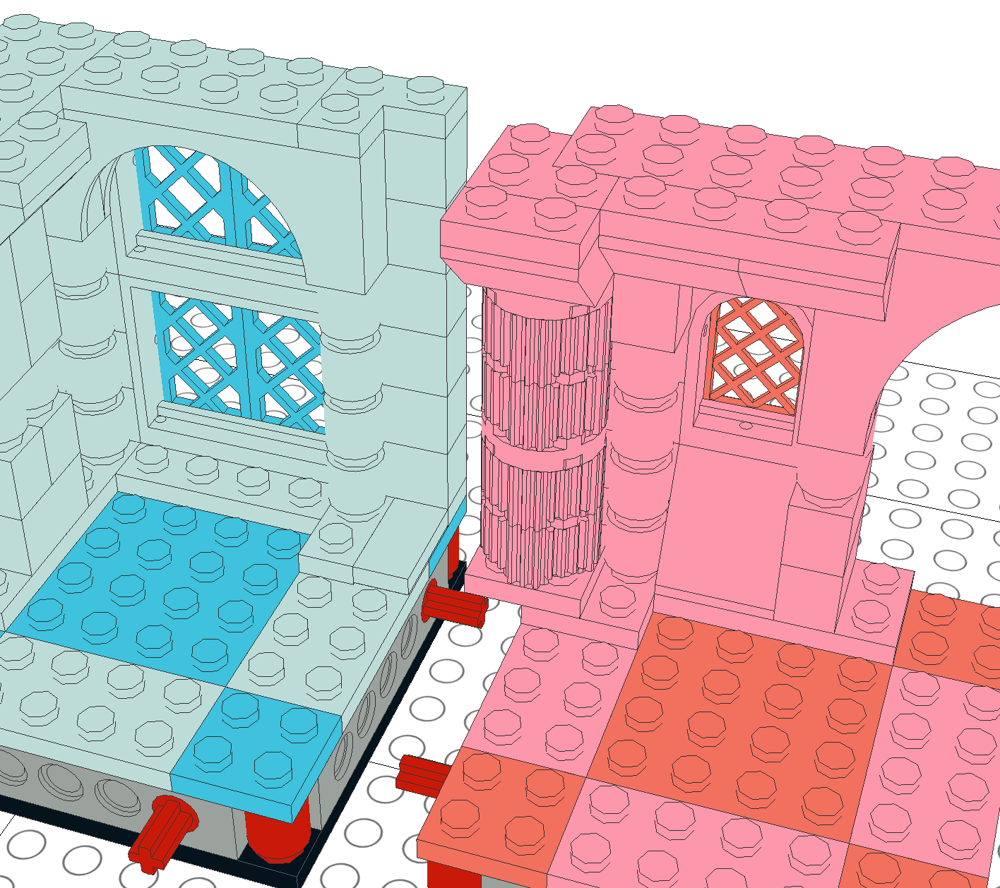

# Specification for Modular *LEGO*® Tabletop Role-Playing Game Dungeons

## Introduction

LEGO is fun.  It is easy to create custom, detailed environments with LEGO primitives; additionally, there is a vast array of figure parts & accessories to fit both fantastic and mundane settings.  The LEGO world is also inherently grid-based, lending itself well to similarly grid-based games.

The goal of this document is to establish a reasonable standard of modular gameplay sections, constructed entirely of LEGO, for the playing of [tabletop role-playing games](https://en.wikipedia.org/wiki/Tabletop_role-playing_game), constrained by these requirements:

* Make the design of modular sections as simple as possible
* Reduce the number of specific parts required to a minimum
* Have optional "good practice" requirements that increase the likelihood sections designed by various people can connect more-or-less seamlessly most of the time

This document is not the first such attempt — see [BrickQuest by Peter F. Guenther](http://gunth.com/brickquest/).  Some elements are the same as in BrickQuest, such as the use of 4×4 [stud](#terminology) game tiles, walls 2 studs in width, and the rough arrangement of game tiles.  However this standard was developed independently, and lacks a number of perceived shortcomings in BrickQuest's design:

* BrickQuest [version 2](http://gunth.com/brickquest/newmod2/modules.htm) assembles sections on LEGO baseplates, which lack stud holes on the bottom.  This precludes a [game master](https://en.wikipedia.org/wiki/Gamemaster) from using any kind of ad-hoc stacking or variable elevation in setting up a dungeon.
* The use of [pins](#terminology) as connectors may make it difficult to detach sections.
* The standard 12×12 stud section has surface area dedicated to walls, and cannot be halved for very small sections.
* There are a separate class of constructs used as dedicated room connectors.

## Terminology

|  |  |
|---|---|
| *stud* | the basic LEGO round connector, usually found arrayed on the top surface of *bricks* and *tiles*, and used as a basic unit of measurement |
| *brick* | the basic LEGO building piece, and used as a basic unit of measurement |
| *tile* | a class of LEGO piece that is ⅓ of a *brick* in height, and used as a alternate unit of measurement |
| *slope* | a class of LEGO piece that has an upwards or downwards sloping section |
| *pin* | a LEGO Technic piece consisting of one or more stud-length partially-split hollow tubes with a bead around the edge of the split end, typically used as a connector that only permits rotation around the tube's axis |
| *axle* | A LEGO Technic piece consisting of a cruciform rod the same diameter as a pin |
| *section* | the basic modular building block of a dungeon |
| *game tile* | a division of game-space on which a single character can reside |
| *wall* | a game-space division marker through while characters typically cannot pass |
| *Minifigure* | the standard posable LEGO figurine; when not decorated with items, 4 *bricks* in height, about 4 studs in width, and about 2 studs in depth; the standard "skin" color is yellow |

When a specific LEGO part needs to be named, the [LDraw](http://ldraw.org/) part names will be used.

**Examples of bricks**

**Examples of tiles**

**Examples of slopes**

**Examples of pins and pinned parts**

**Examples of axles and variant parts**

**Example of an undecorated Minifigure**

## Section Dimensions & Game Tile Layout

The entire gameplay grid is based on 4×4 stud LEGO tiles.  While these LEGO tiles are slightly larger than a standard 1"×1" TTRPG grid, they are close enough (about 32mm × 32mm or 1.26" × 1.26" ) — and the ideal size for a LEGO Minifigure.

Each full-sized modular section is 16×16 studs, meaning 16 (4×4) game tiles can fit on each.  Half sections can be constructed as 4×2 game tile sections (16×8 studs), quarter sections as 2×2 game tile sections (8×8 studs).

All sections abut directly against each other with no separators, aligned by the quarter section.

One noticeable feature of the game tile layout is that it is shifted by half a game tile (2 studs) in both directions on its plane.  This leaves a half-game-tile (2 stud) border on the surface of each regular section, which has several benefits.  One is that sections can be rotated and joined on any side; the "light" and "dark" squares will align regardless.  Another benefit is that there is always a "center" game tile on a section. Finally, as there are no separate wall sections, this 2-stud boarder is an ideal area to place walls if that section requires them — see [*Walls*](#walls).

## Base Construction & Interface

Few specific parts are required for constructing sections bases; the only thing that matters is that the interface between sections matches.

The height of a standard base is 5 tiles — 1 brick and 2 tiles.  This is to allow for a plate (not a baseplate) on the bottom to act as a building foundation, 1 brick to account for the alignment setup, and another layer of plates on top for game tiles.  A height of 5 tiles rather than an even 2 bricks was chosen to minimize the parts necessary to conform to the specification.  It is also debatable where to place the third layer of plates in a naïve base construction.  If section bases 2 bricks in height are preferred, the specification allows the addition of arbitrary-height spacers — see [*Elevation Changes*](#elevation-changes).

Section alignment uses axles on one side mated to pin holes on the other.  A full 16-stud section side will have two axles and two pin holes; a half-sized 8-stud section side will have one of each.  The pins and holes are laid out as such:

This way, full-, half-, and quarter-sized sections can be combined with ease.

Note that the corners are constructed with 1×1 round bricks.  This is regardless of base dimensions — whether a full-sized, quarter-sized, or some other configuration, these bricks should be placed on each convex corner.  These are to assist in section separation in the rare cases leverage is needed to assist in separation.  If a section is very delicate or somehow stuck to another, a screwdriver or other prying tool can be inserted between the round bricks.

### Construction Notes

Several alternatives were considered as connectors:

* Full pins offer too much resistance, making disconnecting sections difficult.  In addition, if full pins rather than pin bricks are used, there is no friction bias to keep the pin in the male side's hole, meaning some repair work may have to be done while disassembling dungeons.
* ½ pins would appear to be ideal as their short end is a stud, meaning the pin/hole interface could be replaced with a simple stud interface if needed.  This could be done if there was a part shortage, or if an unusual design required alternate parts.  However in practice, ½ pins tend to be biased towards the *female* side; pins have a slight tolerance to allow rotation, meaning they offer less friction than a stud when attached to a pin hole.
* ¾ pins have the same issues as both full and ½ pins.

This standard opts for the use of axles rather than pins for the male side, and sections are simply aligned rather than actually attached to each other.  This improves ease of dungeon assembly and disassembly — see [*Area Revelation*](#area-revelation).  Given a reasonably-sized dungeon on a flat surface, the interlocking action between the modular sections should keep them together; if there is any doubt, a surface cover offering more friction (such as a felt or rubber game mat) can be used underneath.

The use of axles and pin holes gives reasonable flexibility in constructing section bases.  Any method of providing an axle at the appropriate position and height is acceptable.  In fact, the axles need not even extend a full stud from the sides of their base, as they are only used for alignment rather than attachment.  However, at least half a stud is recommended.

The interior construction of a section base is unspecified.  While an array of bricks that properly support the game tiles is suggested, the type and arrangement is up to the builder.

The [examples provided](examples/) for the most part use `Technic Brick 1 x 6 with Holes (3894)` for simplicity.  It is wide enough to be used for a single male/female pair along with a simple axle pin.

## Walls

The arrangement of game tiles on section bases is intended to permit the inclusion of walls directly on the base, rather than as a separate component.  The shifted game tile layout leaves a 2-stud-width boarder around each section; walls will typically be placed here.  Walls will more often than not be permanent fixtures of their design, are are not intended to be modular separate from their bases.

Below is a simple example with two section designs (a hall and three corners) assembled, demonstrating wall thickness.  Note how a "full wall" between playable areas is actually 4 studs — this gives room for relief patterns on the walls while allowing them to also stand alone at the edge of a dungeon.

### Overlapping Walls

In almost every case, a modular section should be contained entirely within the boundaries of its base.  Unfortunately, even some common LEGO pieces do not have half and quarter variants, such as `Brick 2 x 2 Round (3941)` — very useful for building pillars — and `Brick 2 x 2 x 3 with Lion's Head Carving and Cutout (30274)`.  Section creators can simply design around this by avoiding placing these pieces on section divisions.  However, these pieces are also some of the best at visually breaking up section divisions to make them appear seamless and more real.  Some times placing them elsewhere simply does not work with the creator's desired pattern.

As compatibility between section sets is a goal of this standard, in general the use of overlapping patterns using these pieces should be avoided.  On the other hand, in some cases blind compatibility doesn't make sense — a palace hallway typically would not abruptly transition to an outdoor area.  A single room in a dungeon will typically consist of multiple sections designed by the same person to match a single look.  As long as discrete transition sections such as doorways are included, the use of overlapping sections within the room is probably fine.

Certain construction constraints must still be placed on overlapping sections to facilitate the quick assembly and disassembly of dungeons.  Overlapping parts should not be separate elements attached after sections are aligned; rather they should be integrated with one side or another.  As sections must slide together on the axis of their pins, it is recommended to use [tiles](#terminology) on the side without the overlapping part to prevent gaps between surfaces.

[Here is an example](examples#quest_builder_tomb_lairldr) that consists of quarter sections designed to be used to build up bigger rooms:

## Ceilings

* try not to get in the way of placing Minifigures and other objects
* avoid overhangs
* overhangs should extend over game tiles no more than 2 studs past walls
* archways and other doorways are an exception

## Elevation Changes

* stairs, ramps, hillocks, etc.
* should have section connectors all around base; optional but encouraged on side of elevation change
* additional section connectors at floor/ground level on side of elevation change
* shim connecting sections with bricks and tiles as-needed to reach elevation difference

## Stacking

* attach upper sections by 2-12 studs
* probably not a great idea in most cases, use a separate setup for each floor

## Non-Standard Game Tile Arrangements

* outdoor areas
* ornate entrances
* if game tiles don't align, "where" a character is standing is at the game master's discretion

## Area Revelation

* secret doors
* different floors
* other visibility restrictions
* designed to be connected & disconnected quickly