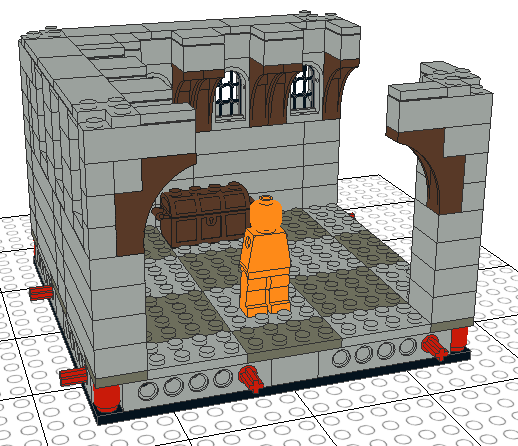
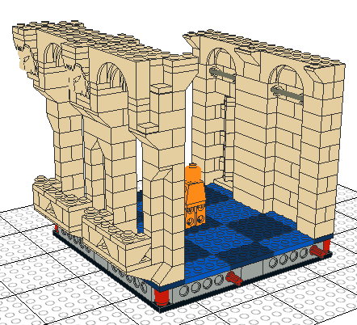
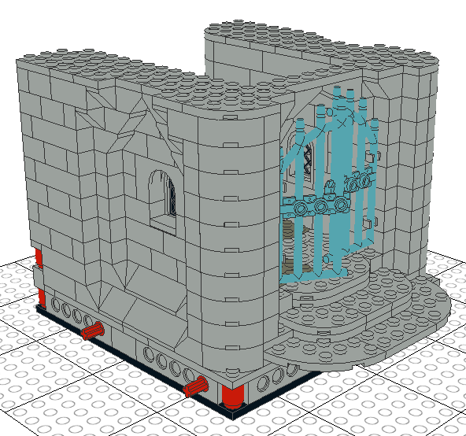
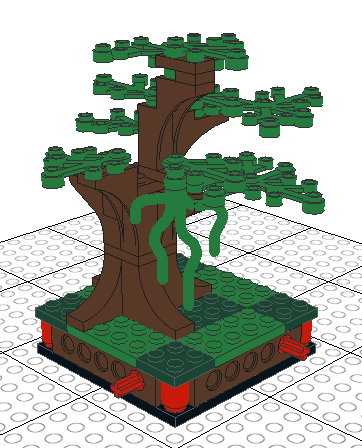
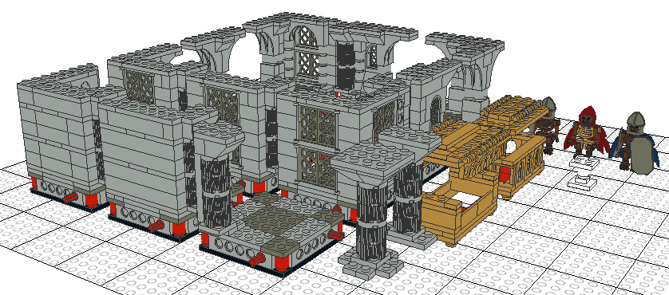
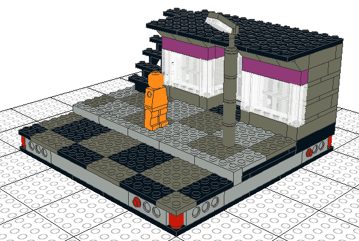

# Examples

The armless, featureless, orange Minifigures in some of the examples are scale references.

## `cellar_corner.ldr`

One of the first concept tests, this example is a full section (16×16 studs) corner.  It was meant to be a fairly standard-looking dungeon or cellar section, with sunken underground windows and an implied arched beam ceiling.  It also was a test for coming up with a standard method of stacking sections.

## `palace_hall.ldr`

An early test, this example is a full section (16×16 studs) upper palace hallway.  It has an exterior wall with large, open archways and balconies.  It also has an inner wall with a secret doorway that can be hidden behind a banner; when discovered, a secret area behind (not included) can be attached by the Dungeon Master.

## `gothic_entryway.ldr`

Another early test, this example is a single, full section (16×16 studs) that includes an elevation change, an enclosed archway, a shifted game tile layout, and an overhang over another section.

## `tree_1.ldr`

A small, basic tree for an outdoor area.

## `Quest_Builder_tomb_lair.ldr`

An interpretation of the "tomb" lair from [Ymarilego](https://ideas.lego.com/profile/Ymarilego)'s [Quest Builder](https://ideas.lego.com/projects/4357ae98-8b43-441a-88b5-017e35bfb0ca).  The design elements have been scaled up and split into reusable quarter sections (8×8 studs).  The example also includes some objects to use in the dungeon: three enemy figures, two sarcophagus designs, two central pillar designs, and a small pedestal.

## `old/cyberpunk_corner.ldr`

An early test for an alternate 20×20 stud section standard.  It will be converted to several 16×16 stud sections later.